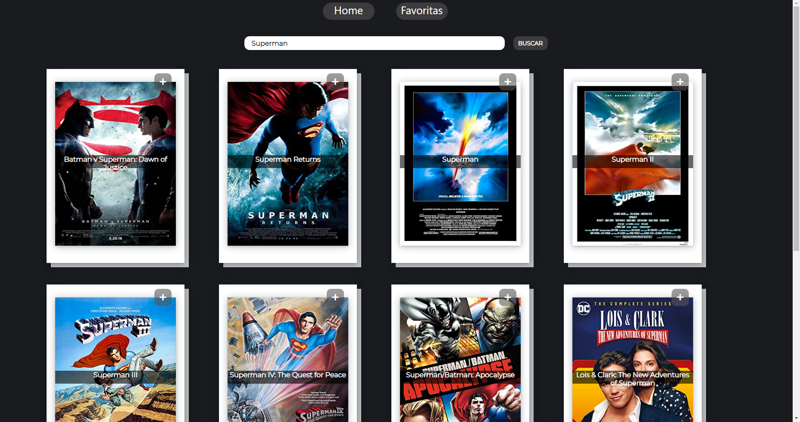

URL : https://infallible-yalow-5844a9.netlify.app/

Desarrollo de un SPA (Single Page Application) Utilizando React para el Front End y Redux como state management. Todos los componentes fueron desarrollados con css sin uso de librerías externas.
La SPA consume datos de una API (OMDb API) 

 

 

